# Architecture

## 1. Adapter Hierarchy

The core abstraction — interfaces in `:core`, implementations in feature modules.

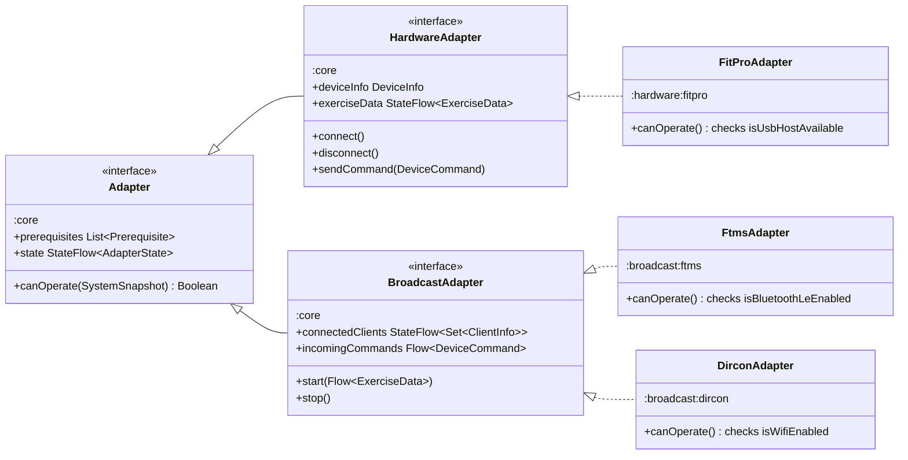

## 2. Data Flow Types

What flows through the adapter pipeline — exercise telemetry down, device commands up.

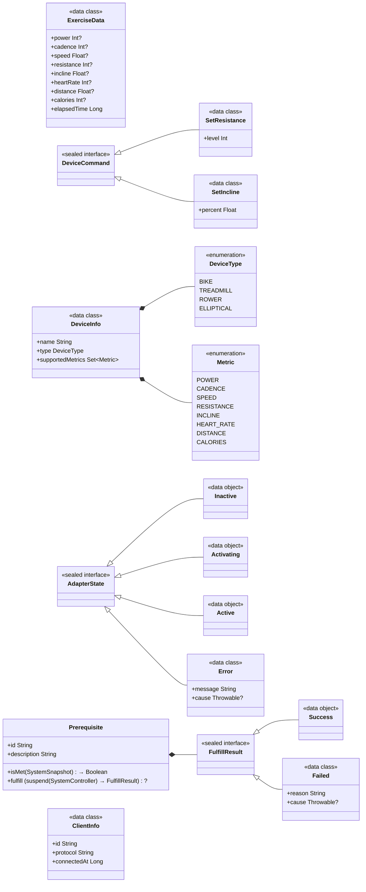

## 3. System Monitoring

Read/write split — `SystemMonitor` observes, `SystemController` mutates.

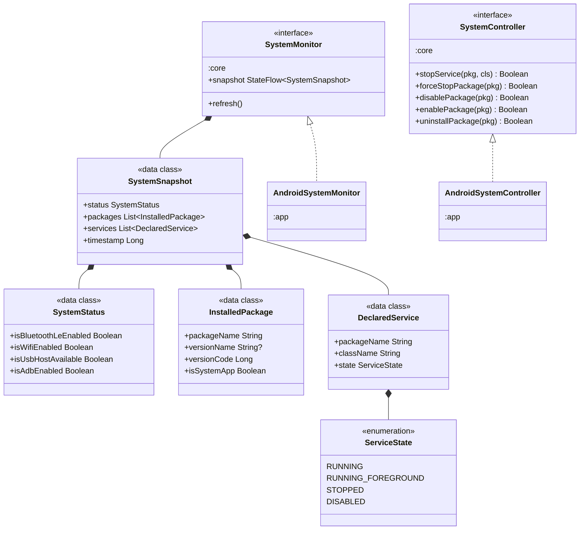

## 4. Logging

Dual-interface pattern — `AppLogger` for writing, `LogStore` for reading. Both implemented by one singleton.

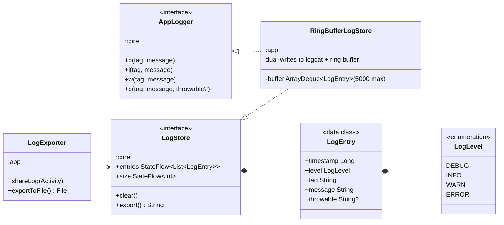

## 5. In-App Update System

Two independent update tracks (app APK + firmware OTA) sharing a common download-verify-install pipeline. Entirely within `:app` — no `:core` interfaces needed.

### 5a. Update Class Hierarchy

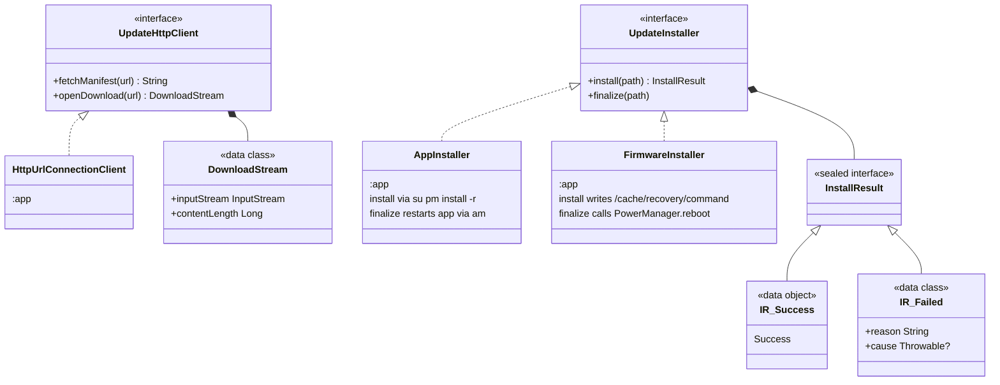

### 5b. Update State Machine

Each track (`appTrack`, `firmwareTrack`) has its own independent `StateFlow<TrackState>`.

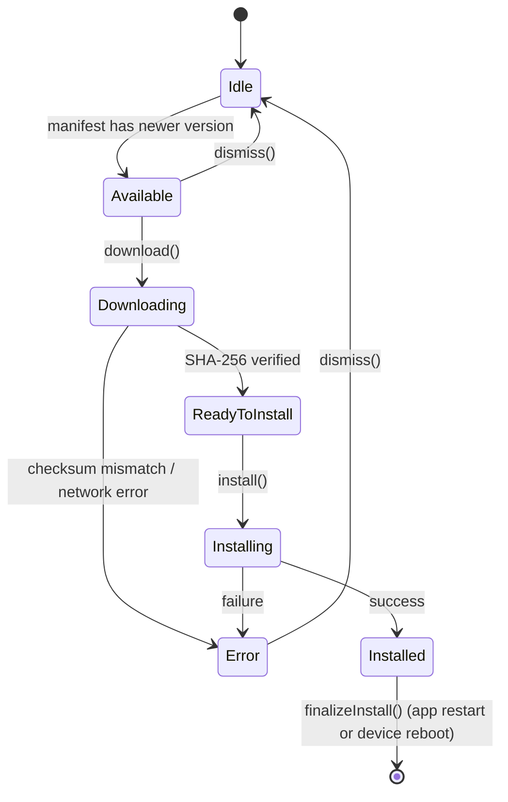

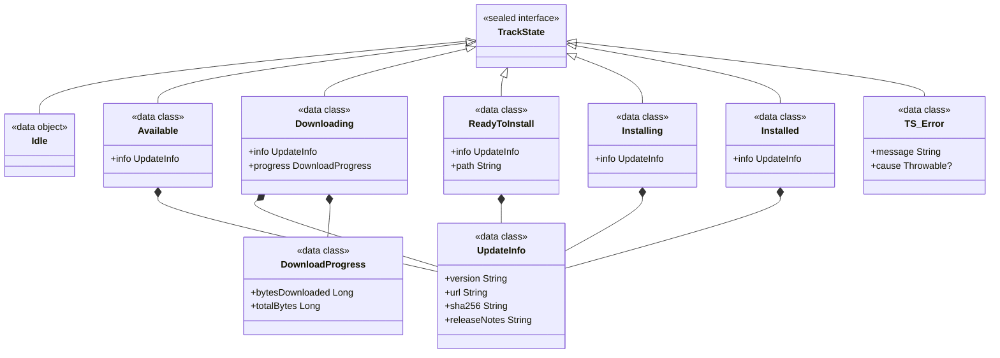

### 5c. Update Orchestration

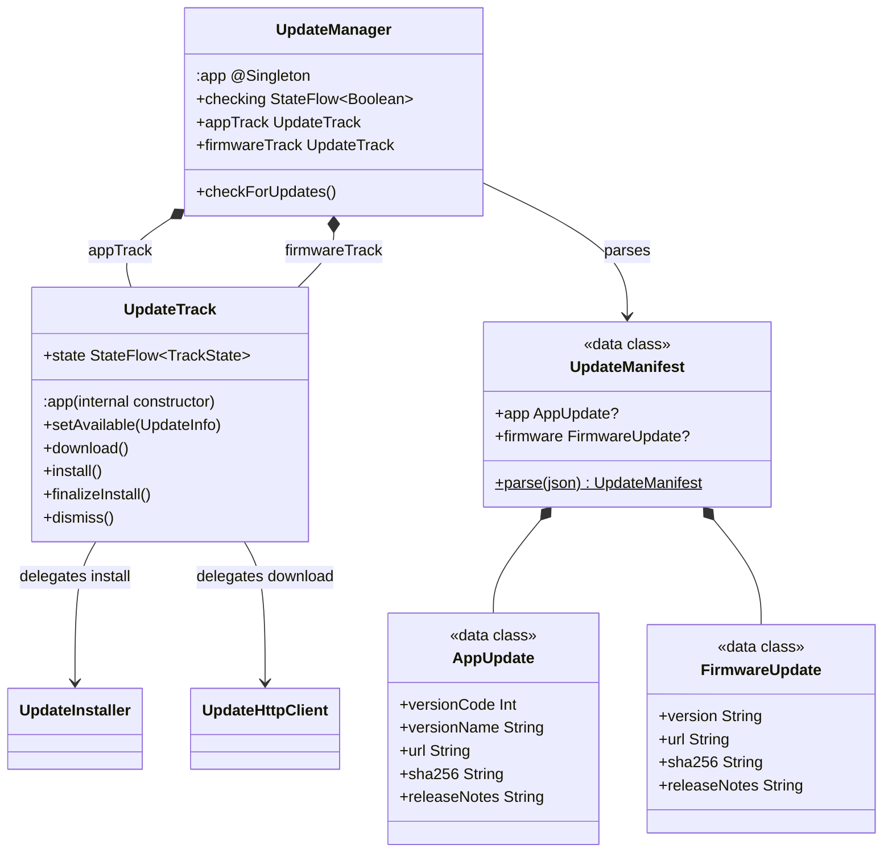

### 5d. Update Data Flow

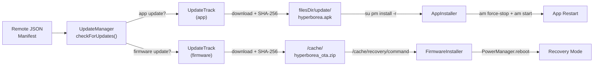

## 6. Hilt DI Wiring

How `:app` binds everything together. All bindings are `@Singleton` scope.

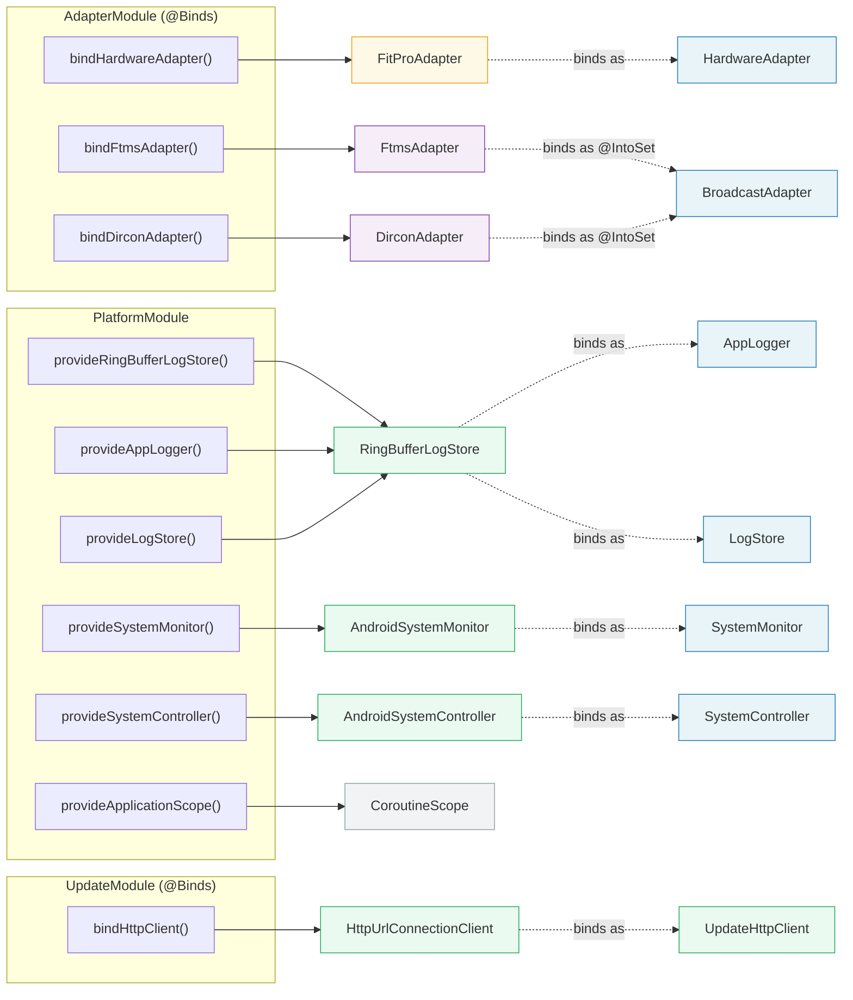

## 7. Runtime Data Flow

The end-to-end pipeline at runtime.

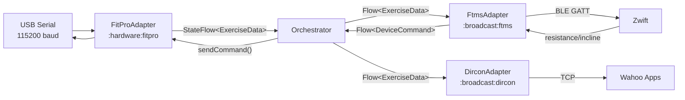

## Module Dependency Graph

```
:app  →  :core  ←  :hardware:fitpro
  ↓                 :broadcast:ftms
  ↓                 :broadcast:dircon
  └── all modules
```

All feature modules depend only on `:core`. The `:app` module wires everything together via Hilt.

## Relationship Key

| Arrow | Meaning |
|-------|---------|
| `<\|--` solid | Interface inheritance (extends) |
| `<\|..` dashed | Implementation (implements) |
| `*--` | Composition (owns / contains) |
| `-->` | Dependency (uses / provides) |
| `-.->` dashed | DI binding (binds as interface) |
